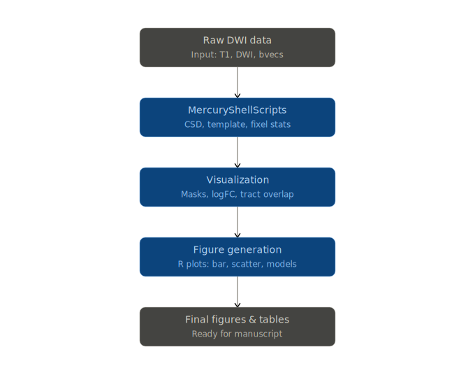
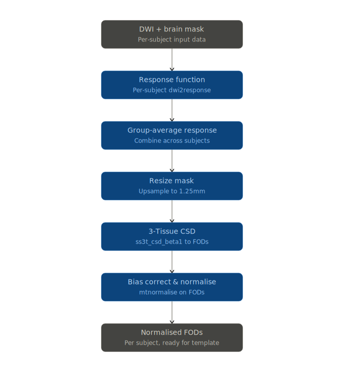

# Fixel-Based Analysis Modular Pipeline (Lerner Repo)

This repository is a modular and educational reorganization of fixel-based analysis workflows for diffusion MRI (DWI) data.
It is based on HasiniWeerathunge/FixelBasedAnalysis. Here, structure, code, and documentation are optimized for learnability and reproducibility.

## Top-Level Folders
- `00_DataPreprocessing/`: For DWI-to-preprocessed data pipeline (shell scripts, session logs)
- `01_FixelPipeline/`: Scripts and structure for the MRtrix fixel pipeline and batch execution
- `02_StatisticalAnalysis/`: R/fixelfestats shell scripts and model design files
- `03_Visualization/`: All scripts for R-based and shell-based results visualization
- `04_TraitBasedAnalysis/`: ROI, tract, and trait-based post-processing and documentation
- `05_QualityControl/`: QA scripts and logs
- `docs/`: Central teaching documentation
- `templates/`: Templates for subject lists, matrices, and code snippets

See each folder's README for complete details.

